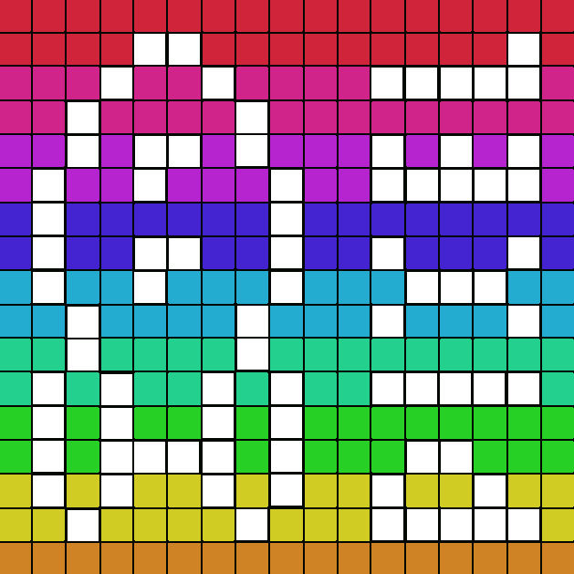

# Color Pixel



A collaborative pixel-art editor for Webxdc.
Every user will draw using their profile color.

## Contributing

### Installing Dependencies

After cloning this repo, install dependencies:

```
pnpm i
```

### Checking code format

```
pnpm check
```

### Testing the app in the browser

To test your work in your browser (with hot reloading!) while developing:

```
pnpm start
```

### Building

To package the WebXDC file:

```
pnpm build
```

To package the WebXDC with developer tools inside to debug in Delta Chat, set the `NODE_ENV`
environment variable to "debug":

```
NODE_ENV=debug pnpm build
```

The resulting optimized `.xdc` file is saved in `dist-xdc/` folder.

### Releasing

To automatically build and create a new GitHub release with the `.xdc` file:

```
git tag -a v1.0.1
git push origin v1.0.1
```
